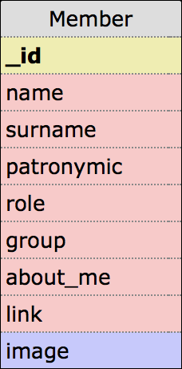

# DSoW

## Основной функционал:

- Представление участников команды в виде списка
- Получения полной информации об участнике
- Редактирование фотографии в карточке участника

## Особенности реализации

### Дизайн

В качестве основного дизайна мобильного приложения был использован ***Material Design*** от ***Google***. В качестве цветовой схемы приложение выбран ***Indigo***. Приложение работает только в вертикальном режиме, так как в ходе формирования интерфейса было принято решение о нецелесообразности отображения основного контента приложения в горизонтальном виде.

### UI

Отображение полного списка участников выполнено в виде отдельных карточек, дающих основную информацию об участнике: фотография, имя, фамилия и роль в команде. 

По тапу на карточку она раскрывается, отображая полную информацию об участнике, в которую входят:

- Фото 
- ФИО
  - Фамилия
  - Имя
  - Отчество
- Роль в команде
- Учебная группа
- "О себе"
- Ссылка на веб-сайт

 

Информацию "о себе" можно промотать. Это сделано для того, чтобы при большом тексте он не занимал все место на экране.

В окне полной информации есть кнопка, позволяющая войти в режим изменения фотографии. По нажатию на ссылку происходит переход в браузер по данному адресу.

При добавлении фото пользователь может путем передвижения фотографии после загрузки ее в приложение обрезать ее. Это позволит пользователю самому выбрать то, как будет отображаться его фотография.

 

### Структура базы данных

В качестве СУБД был выбран ***SQLite***. Для взаимодействия приложения и СУБД была выбрана ORM технология ***Room*** от ***Google***.

## Тестирование

Приложение запускается через ***Android Studio*** посредством встроенной утилиты ***adb*** на настоящем устройстве ***Sumsung Galaxy J5*** (аналогом этого устройства может быть эмулятор ***Nexus 4***). Подобный вариант тестирования был выбран в связи с поломкой видеокарты на рабочем компьютере. Приложение не тестировалось на устройствах с нестандартным отношением сторон экрана, на планшетах. Адаптация дизайна под телефоны с ***"бровями"*** так же не было осуществлена.

Поскольку база данных хранится на устройстве, то фотографий, указанных на скриншотах вы не увидите. Однако поскольку существует функционал добавление фотографий, то мы прилагаем эти фотографии к проекту. Они находятся в папке ***Photos***. Их добавление обязательно.

Для тестирования необходимо использовать android 7.0. 
